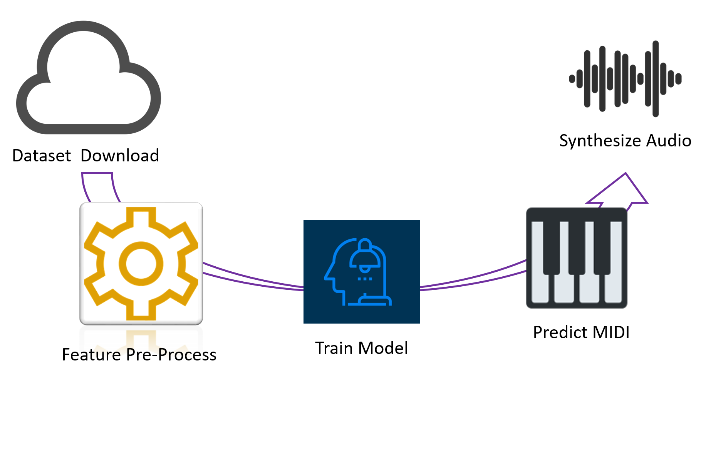

.. omnizart documentation master file, created by
   sphinx-quickstart on Tue Aug 25 10:43:56 2020.
   You can adapt this file completely to your liking, but it should at least
   contain the root `toctree` directive.

Omniscient Mozart
=================

**Omnizart**, a command line tool for all kinds of transcription tasks, including vocal melody, drum percussion,
chord progression, notes of instruments, and beat tracking.

Provides a consistent way for managing the life-cycle of transcription tasks, from dataset
downloading, feature pre-processing, model training, to the final MIDI inference and synthesizing
the output MIDI to raw audio. Pre-trained models are also provided for immediate use.

Everything are deliberately designed for the ease of use. We've put a large amount of energies
and time for making ``omnizart`` comfortable to use.

   Omnizart provides a complete solution for managing every stage in the life-cycle of transcription tasks.

Demo
####

Here is an demonstration of the chord and drum transcription using our system.

.. raw:: html

   <iframe width="560" height="315" src="https://www.youtube-nocookie.com/embed/hjJhweRlE-A" frameborder="0" allow="accelerometer; autoplay; clipboard-write; encrypted-media; gyroscope; picture-in-picture" allowfullscreen></iframe>

Result of chord transcription.

.. raw:: html

   <audio controls="controls">
      <source src="_audio/high_chord_synth.mp3" type="audio/mpeg">
      Your browser does not support the <code>audio</code> element.
   </audio>

Result of drum transcription.

.. raw:: html

   <audio controls="controls">
      <source src="_audio/high_drum_synth.mp3" type="audio/mpeg">
      Your browser does not support the <code>audio</code> element.
   </audio>

All works are developed by `MCTLab <https://sites.google.com/view/mctl/home>`_.

.. toctree::
   :maxdepth: 2
   :caption: Contents

   quick-start.rst
   tutorial.rst
   music/cli.rst
   drum/cli.rst
   chord/cli.rst

.. toctree::
   :maxdepth: 2
   :caption: API Reference

   music/api.rst
   drum/api.rst
   chord/api.rst
   feature.rst
   models.rst
   training.rst
   base.rst
   constants.rst
   utils.rst

.. Indices and tables
  ==================
   * :ref:`genindex`
   * :ref:`modindex`
   * :ref:`search`
