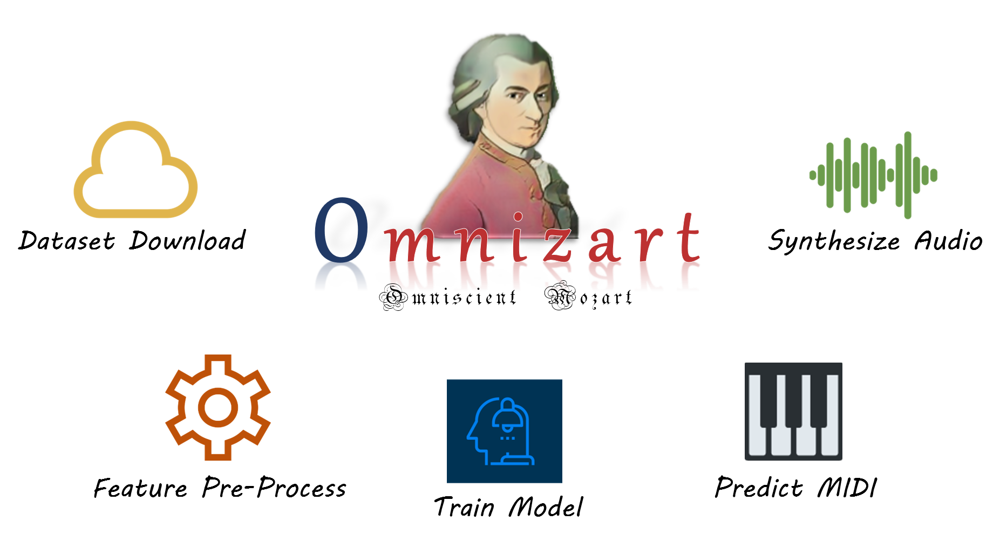

.. omnizart documentation master file, created by
   sphinx-quickstart on Tue Aug 25 10:43:56 2020.
   You can adapt this file completely to your liking, but it should at least
   contain the root `toctree` directive.

OMNIZART: MUSIC TRANSCRIPTION MADE EASY
=======================================

Omnizart is a Python library and a streamlined solution for automatic music transcription.
This library gathers the research outcomes from `Music and Cultural Technology Lab <https://sites.google.com/view/mctl/home>`_, 
analyzing polyphonic music and transcribes 
**musical notes of instruments** :cite:`music`,
**chord progression** :cite:`chord`,
**drum events** :cite:`drum`,
**frame-level vocal melody** :cite:`vocalcontour`,
**note-level vocal melody**  :cite:`vocal`, and
**beat** :cite:`beat`.

Omnizart provides the main functionalities that construct the life-cycle of deep learning-based music transcription,
covering from *dataset downloading*, *feature pre-processing*, *model training*, to *transcription* and *sonification*.
Pre-trained checkpoints are also provided for the immediate usage of transcription. The paper can be found from
`Journal of Open Source Software (JOSS) <https://doi.org/10.21105/joss.03391>`_.

Demonstration
#############

Colab
*****

Play with the `Colab notebook <https://bit.ly/OmnizartColab>`_ to transcribe your favorite song almost immediately!

Replicate web demo
******************

Transcribe music with `Replicate web UI <https://replicate.com/breezewhite/omnizart>`_.

Sound samples
*************

Original song

.. raw:: html

   <iframe src="https://www.youtube-nocookie.com/embed/hjJhweRlE-A" frameborder="0" allow="accelerometer; autoplay; clipboard-write; encrypted-media; gyroscope; picture-in-picture" allowfullscreen></iframe>

Chord transcription

.. raw:: html

   <audio controls="controls">
      <source src="_audio/high_chord_synth.mp3" type="audio/mpeg">
      Your browser does not support the <code>audio</code> element.
   </audio>

Drum transcription

.. raw:: html

   <audio controls="controls">
      <source src="_audio/high_drum_synth.mp3" type="audio/mpeg">
      Your browser does not support the <code>audio</code> element.
   </audio>

Note-level vocal transcription

.. raw:: html

   <audio controls="controls">
      <source src="_audio/high_vocal_synth.mp3" type="audio/mpeg">
      Your browser does not support the <code>audio</code> element.
   </audio>

Frame-level vocal transcription

.. raw:: html

   <audio controls="controls">
      <source src="_audio/high_vocal_contour.mp3" type="audio/mpeg">
      Your browser does not support the <code>audio</code> element.
   </audio>

Source files can be downloaded `here <https://drive.google.com/file/d/15VqHearznV9L83cyl61ccACsXXJ4vBHo/view?usp=sharing>`_.
You can use *Audacity* to open the files.

.. toctree::
   :maxdepth: 2
   :caption: Contents

   quick-start.rst
   tutorial.rst
   demo.rst

.. toctree::
   :maxdepth: 2
   :caption: Command Line Interface

   music/cli.rst
   drum/cli.rst
   chord/cli.rst
   vocal/cli.rst
   vocal-contour/cli.rst
   beat/cli.rst
   patch-cnn/cli.rst

.. toctree::
   :maxdepth: 2
   :caption: API Reference

   music/api.rst
   drum/api.rst
   chord/api.rst
   vocal/api.rst
   vocal-contour/api.rst
   patch-cnn/api.rst
   beat/api.rst
   feature.rst
   models.rst
   training.rst
   base.rst
   constants.rst
   utils.rst

.. Indices and tables
  ==================
   * :ref:`genindex`
   * :ref:`modindex`
   * :ref:`search`

References
##########

.. bibliography::
   refs.bib
